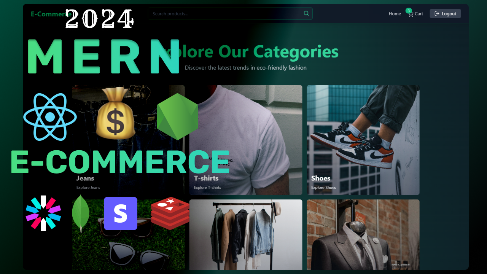

# 🚀 MERN E-commerce Store

A full-stack e-commerce application built with the MERN (MongoDB, Express.js, React, Node.js) stack, offering a seamless shopping experience with robust features for both users and administrators.

## ✨ Features

This application provides a comprehensive set of features to manage products, users, orders, and more:

### 🛍️ User Features
*   **Product Browsing & Search**: Explore products by categories and search for specific items.
*   **Product Details**: View detailed information about each product, including descriptions and images.
*   **Shopping Cart**: Add, update, and remove items from your cart.
*   **User Authentication**: Secure user registration, login, and logout functionalities.
*   **Order Management**: View past orders and their statuses.
*   **Payment Integration**: Secure checkout process powered by Stripe.
*   **Coupons**: Apply discount coupons during checkout.
*   **Responsive Design**: A user-friendly interface that adapts to various screen sizes, powered by Tailwind CSS.
*   **Theme Toggle**: Switch between light and dark modes for a personalized experience.

### ⚙️ Admin Features
*   **Product Management**: Create, Read, Update, and Delete (CRUD) products.
*   **Order Tracking**: Monitor and manage customer orders.
*   **User Management**: Manage user accounts.
*   **Coupon Management**: Create and manage promotional coupons.
*   **Analytics Dashboard**: View sales data and other key metrics.

## 🛠️ Technologies Used

This project leverages a modern stack for both frontend and backend development:

### Backend
*   **Node.js**: JavaScript runtime for server-side logic.
*   **Express.js**: Fast, unopinionated, minimalist web framework for Node.js.
*   **MongoDB**: NoSQL database for flexible data storage.
*   **Mongoose**: MongoDB object data modeling (ODM) for Node.js.
*   **JWT (JSON Web Tokens)**: For secure authentication.
*   **Bcrypt.js**: For password hashing.
*   **Cloudinary**: Cloud-based image and video management.
*   **Stripe**: Payment processing.
*   **Redis**: In-memory data store, used for caching or session management.

### Frontend
*   **React**: A JavaScript library for building user interfaces.
*   **Vite**: Next-generation frontend tooling for fast development.
*   **Tailwind CSS**: A utility-first CSS framework for rapid UI development.
*   **Axios**: Promise-based HTTP client for making API requests.
*   **Zustand**: A fast and scalable bearbones state-management solution.

##  Prerequisites

Before you begin, ensure you have the following installed on your machine:
*   [Node.js](https://nodejs.org/en/) (v14.x or higher)
*   [MongoDB](https://www.mongodb.com/try/download/community)
*   [Git](https://git-scm.com/)

You will also need accounts and API keys for:
*   [Cloudinary](https://cloudinary.com/)
*   [Stripe](https://stripe.com/)
*   [Redis](https://redis.io/) (for local development, you can run a Redis server)

## 📦 Installation

Follow these steps to set up the project locally:

1.  **Clone the repository:**
    ```bash
    git clone https://github.com/whoissajo/mern-ecommerce.git
    cd mern-ecommerce
    ```

2.  **Install Backend Dependencies:**
    ```bash
    npm install
    ```

3.  **Install Frontend Dependencies:**
    ```bash
    npm install --prefix frontend
    ```

## ⚙️ Environment Variables

Create a `.env` file in the root directory of the project (where `package.json` is located) and add the following environment variables:

```
NODE_ENV=development
PORT=5000
MONGO_URI=your_mongodb_connection_string
JWT_SECRET=your_jwt_secret_key
CLOUDINARY_CLOUD_NAME=your_cloudinary_cloud_name
CLOUDINARY_API_KEY=your_cloudinary_api_key
CLOUDINARY_API_SECRET=your_cloudinary_api_secret
STRIPE_SECRET_KEY=your_stripe_secret_key
REDIS_URL=redis://127.0.0.1:6379 # Or your Redis connection URL
FRONTEND_URL=http://localhost:5173 # Or your frontend deployment URL
```

**Note**: For `MONGO_URI`, if you're running MongoDB locally, it might be something like `mongodb://localhost:27017/ecommerce`.

## ▶️ Usage

To run the application in development mode:

1.  **Start the Backend Server:**
    ```bash
    npm run dev
    ```
    The backend server will run on `http://localhost:5000` (or your specified PORT).

2.  **Start the Frontend Development Server:**
    Navigate to the `frontend` directory and start the React app:
    ```bash
    cd frontend
    npm run dev
    ```
    The frontend application will typically run on `http://localhost:5173`.

### 📊 Seeding Data

You can seed initial product data into your database using the provided script:

```bash
npm run seed
```

## 📸 Screenshot



## 🤝 Contributing

Contributions are welcome! If you have suggestions or want to improve the project, please feel free to:
1.  Fork the repository.
2.  Create a new branch (`git checkout -b feature/your-feature-name`).
3.  Make your changes.
4.  Commit your changes (`git commit -m 'feat: Add new feature'`).
5.  Push to the branch (`git push origin feature/your-feature-name`).
6.  Open a Pull Request.

## 📜 License

This project is licensed under the ISC License.
